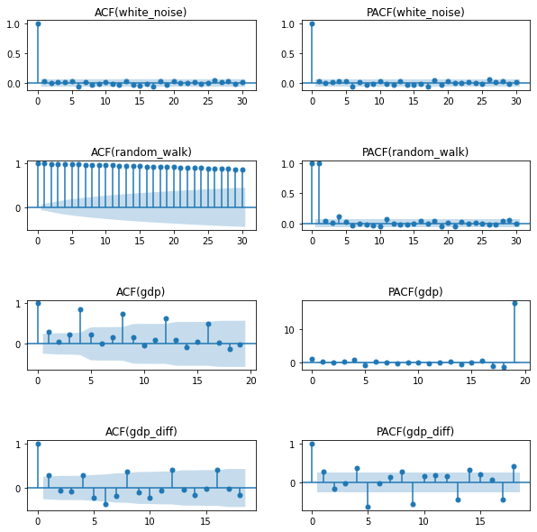

# 时间序列问题研究

## 1. Task 1 序列稳定性检验方法汇总

稳定性的数学定义：
假定某个时间序列是由某一随机过程生成的，如果满足以下条件：

1. 均值 $E(X_t) = \mu$  是与时间t无关的常数
2. 方差 $Var(X_t) = \sigma ^ 2$ 是与时间无关的常数
3. 协方差$Cov(X_t,X_{t-1} )  = \gamma_k$ 只与时间间隔$k$有关与时间$t$无关的常数
   

则该时间序列是宽平稳的

### 1.1数据图形化检验

图形化分析是最简单，最基本的方法，直接绘制数据的时序图，用肉眼判断。


```python
import numpy as np
import pandas as pd
import akshare as ak
from matplotlib import pyplot as plt
 
np.random.seed(123)
 
# -------------- 准备数据 --------------
# 白噪声
white_noise = np.random.standard_normal(size=1000)
 
# 随机游走
x = np.random.standard_normal(size=1000)
random_walk = np.cumsum(x)
 
# GDP
df = ak.macro_china_gdp()
df = df.set_index('季度')
df.index = pd.to_datetime(df.index)
gdp = df['国内生产总值-绝对值'][::-1].astype('float')
 
# GDP DIFF
gdp_diff = gdp.diff(4).dropna()
 
 
# -------------- 绘制图形 --------------
fig, ax = plt.subplots(2, 2)
 
ax[0][0].plot(white_noise)
ax[0][0].set_title('white_noise')
ax[0][1].plot(random_walk)
ax[0][1].set_title('random_walk')
 
ax[1][0].plot(gdp)
ax[1][0].set_title('gdp')
ax[1][1].plot(gdp_diff)
ax[1][1].set_title('gdp_diff')
 
plt.show()
```


    

    


从上面四幅图可以看出：\
a. 白噪声，曲线围绕0值上下波动，波动幅度前后、上下一致，为平稳序列。\
b. 随机游走，曲线无确定趋势，均值、方差波动较大，非平稳序列。\
c. GDP数据趋势上升，均值随时间增加，非平稳序列。\
d. GDP季节差分后数据，曲线大致在一条水平线上上下波动，波动幅度前后变化较小，可认为是平稳的。


该方法虽然直观，但是具有一定的主观性，在数据相对好观察的时候可以使用。

### 1.2统计特征可视化检验

可视化统计特征，是指绘制时间序列的自相关图和偏自相关图，根据自相关图的表现来判断序列是否平稳。

自相关，也叫序列相关，是一个信号与自身不同时间点的相关度，或者说与自身的延迟拷贝--或滞后--的相关性，是延迟的函数。不同滞后期得到的自相关系数，叫自相关图。

（这里有一个默认假设，即序列是平稳的，平稳序列的自相关性只和时间间隔k有关，不随时间t的变化而变化，因而可以称自相关函数是延迟（k）的函数）

平稳序列通常具有短期相关性，**对于平稳的时间序列，自相关系数往往会迅速退化到零（滞后期越短相关性越高，滞后期为0时，相关性为1）；而对于非平稳的数据，退化会发生得更慢，或存在先减后增或者周期性的波动等变动。**


```python
# 数据生成过程在第一个代码块中
from statsmodels.graphics.tsaplots import plot_acf, plot_pacf
 
fig, ax = plt.subplots(4, 2,figsize = (10,10))
fig.subplots_adjust(hspace=1,wspace=0.2)
 
plot_acf(white_noise, ax=ax[0][0])
ax[0][0].set_title('ACF(white_noise)')
plot_pacf(white_noise, ax=ax[0][1])
ax[0][1].set_title('PACF(white_noise)')
 
plot_acf(random_walk, ax=ax[1][0])
ax[1][0].set_title('ACF(random_walk)')
plot_pacf(random_walk, ax=ax[1][1])
ax[1][1].set_title('PACF(random_walk)')
 
plot_acf(gdp, ax=ax[2][0])
ax[2][0].set_title('ACF(gdp)')
plot_pacf(gdp, ax=ax[2][1])
ax[2][1].set_title('PACF(gdp)')
 
plot_acf(gdp_diff, ax=ax[3][0])
ax[3][0].set_title('ACF(gdp_diff)')
plot_pacf(gdp_diff, ax=ax[3][1])
ax[3][1].set_title('PACF(gdp_diff)')
 
plt.show()
```


    

    


(1) 白噪声的自相关系数很快就衰减到0附近，是明显的平稳序列。滞后期为0时自相关系数和偏自相关系数其实就是序列自己和自己的相关性，故为1；滞后期为1时，自相关系数为0，表示白噪声无自相关性。\
(2) 随机游走，自相关系数下降非常缓慢，故为非平稳序列；另从偏自相关系数中可以看到随机游走只和前一项有关。\
(3) GDP数据的自相关图中也可以看到存在一定的周期性，滞后4、8、12等自相关系数较大下降较慢，差分后下降多一些起到一定效果，认为差分后序列是平稳的。同可视化数据一样，直观判断带有较强主观性，但能让我们对数据有更直观的认识

### 1.3简单统计方法

计算统计量的方法只是作为一个补充，了解即可。宽平稳中有两个条件是均值不变和方差不变，可视化数据中我们可以直观看出来，其实还可以具体计算一下看看。

直接将序列前后拆分成2个序列，分别计算这2个序列的均值、方差，对比看是否差异明显。

我们来算白噪声和随机游走序列不同时间段的均值、方差：


```python
import numpy as np
 
np.random.seed(123)
 
white_noise = np.random.standard_normal(size=1000)
 
x = np.random.standard_normal(size=1000)
random_walk = np.cumsum(x)
 
def describe(X):
    split = int(len(X) / 2)
    X1, X2 = X[0:split], X[split:]
    mean1, mean2 = X1.mean(), X2.mean()
    var1, var2 = X1.var(), X2.var()
    print('mean1=%f, mean2=%f' % (mean1, mean2))
    print('variance1=%f, variance2=%f' % (var1, var2))
 
print('white noise sample')
describe(white_noise)
 
print('random walk sample')
describe(random_walk)
```

    white noise sample
    mean1=-0.038644, mean2=-0.040484
    variance1=1.006416, variance2=0.996734
    random walk sample
    mean1=5.506570, mean2=8.490356
    variance1=53.911003, variance2=126.866920
    

白噪声序列均值和方差略有不同，但大致在同一水平线上；
随机游走序列的均值和方差差异就比较大，因此为非平稳序列。

### 假设检验方法

平稳的定量检验方法当前主流为假设检验方法，检验序列中是否存在单位根，若存在，为非平稳序列，不存在即为平稳序列。

#### DF检验

ADF检验（Augmented Dickey-Fuller Testing）是最常用的单位根检验方法之一，通过检验序列是否存在单位根来判断序列是否是平稳的。ADF检验是DF检验的增强版，首先看一下DF检验。

迪基（Dickey）和弗勒（Fuller）1979年基于非平稳序列的基本特征将其大致归为三类并提出DF检验：

(1)当序列基本走势呈现无规则上升或下降并反复时，将其归为无漂移项自回归过程；

(2) 当序列基本走势呈现明显的随时间递增或递减且趋势并不太陡峭时，将其归为带漂移项自回归过程；

(3) 当序列基本走势随时间快速递增时，则将其归为带趋势项回归过程。

原假设：$H_0 : p = 1$ 存在单位根，时间序列为非平稳

备择假设： $H_1 : p < 1   $ 不存在单位根，时间序列是平稳的

若检验统计量大于临界值（p值大于显著性水平  $\alpha$），不能拒绝原假设，序列是非平稳的；


若检验统计量小于临界值（p值小于显著性水平 $\alpha$），拒绝原假设，认为序列是平稳的。

DF的检验公式为一阶自回归过程，为了能适用于高阶自回归过程的平稳性检验，迪基等1984年对DF检验进行了一定的修正，引入了更高阶的滞后项，

生成一个平稳序列。


```python
import numpy as np
from matplotlib import pyplot as plt

np.random.seed(123)

y = np.random.standard_normal(size=100)
for i in range(1, len(y)):
    y[i] = 1 + 0.1*i + y[i]

plt.figure(figsize=(12, 6))
plt.plot(y)
plt.show()
```


    

    


检验该序列是否平稳


```python
from arch.unitroot import ADF
adf = ADF(y)
# print(adf.pvalue)
print(adf.summary().as_text())

adf = ADF(y,trend='ct')
#adf.trend = 'ct'
print(adf.summary().as_text())
```

       Augmented Dickey-Fuller Results   
    =====================================
    Test Statistic                 -0.739
    P-value                         0.836
    Lags                                5
    -------------------------------------
    
    Trend: Constant
    Critical Values: -3.50 (1%), -2.89 (5%), -2.58 (10%)
    Null Hypothesis: The process contains a unit root.
    Alternative Hypothesis: The process is weakly stationary.
       Augmented Dickey-Fuller Results   
    =====================================
    Test Statistic                 -9.963
    P-value                         0.000
    Lags                                0
    -------------------------------------
    
    Trend: Constant and Linear Time Trend
    Critical Values: -4.05 (1%), -3.46 (5%), -3.15 (10%)
    Null Hypothesis: The process contains a unit root.
    Alternative Hypothesis: The process is weakly stationary.
    

arch包中ADF检验可指定trend为:

'n'（不含截距项和时间趋势项）\
'c'（含截距项）\
'ct'（含截距项和时间趋势项）\
'ctt'（含截距项和时间趋势项和二次型时间趋势项）\
分别对应不同平稳类型的检验。（滞后期lags默认为AIC最小）\

以上第一个文本输出中，不指定trend默认为检验是否含截距项平稳，显著性水平p=0.836>0.05，不拒绝原假设，非平稳；\
以上第二个文本输出中，指定trend为检验是否含截距项和时间趋势项平稳，显著性水平p=0.000<0.05，拒绝原假设，故为趋势项平稳。

检验GDP数据使用季节差分后是否平稳


```python
from arch.unitroot import ADF
adf = ADF(gdp)
print(adf.summary().as_text())

adf = ADF(gdp_diff)
print(adf.summary().as_text())
```

       Augmented Dickey-Fuller Results   
    =====================================
    Test Statistic                  1.868
    P-value                         0.998
    Lags                                7
    -------------------------------------
    
    Trend: Constant
    Critical Values: -3.55 (1%), -2.91 (5%), -2.59 (10%)
    Null Hypothesis: The process contains a unit root.
    Alternative Hypothesis: The process is weakly stationary.
       Augmented Dickey-Fuller Results   
    =====================================
    Test Statistic                 -2.655
    P-value                         0.082
    Lags                                8
    -------------------------------------
    
    Trend: Constant
    Critical Values: -3.56 (1%), -2.92 (5%), -2.60 (10%)
    Null Hypothesis: The process contains a unit root.
    Alternative Hypothesis: The process is weakly stationary.
    

可以看到差分前p值为0.998>0.05，不能拒绝原假设，数据非平稳；差分后p值为0.003<0.05，故在5%的显著性水平下可拒绝原假设，差分后的数据是平稳的。

#### PP检验

Phillips和Perron(1988) 提出一种非参数检验方法，主要是为了解决残差项中潜在的序列相关和异方差问题，其检验统计量的渐进分布和临界值与 ADF检验相同。同样出现较早，假设条件一样，用法相似，可作为ADF检验的补充。

原假设和备择假设与ADF检验一致。


```python
import numpy as np
from arch.unitroot import PhillipsPerron

np.random.seed(123)

y = np.random.standard_normal(size=100)
for i in range(1, len(y)):
    y[i] = 1 + 0.1*i + y[i]


pp = PhillipsPerron(y)
print(pp.summary().as_text())

pp = PhillipsPerron(y,trend='ct')
#pp.trend = 'ct'
print(pp.summary().as_text())
```

         Phillips-Perron Test (Z-tau)    
    =====================================
    Test Statistic                 -2.825
    P-value                         0.055
    Lags                               12
    -------------------------------------
    
    Trend: Constant
    Critical Values: -3.50 (1%), -2.89 (5%), -2.58 (10%)
    Null Hypothesis: The process contains a unit root.
    Alternative Hypothesis: The process is weakly stationary.
         Phillips-Perron Test (Z-tau)    
    =====================================
    Test Statistic                -10.009
    P-value                         0.000
    Lags                               12
    -------------------------------------
    
    Trend: Constant and Linear Time Trend
    Critical Values: -4.05 (1%), -3.46 (5%), -3.15 (10%)
    Null Hypothesis: The process contains a unit root.
    Alternative Hypothesis: The process is weakly stationary.
    

不指定trend为默认检验是否为带截距项的平稳过程，检验结果p值为0.055>0.05，对应检验统计量为-2.825大于5%显著性水平下的临界值-2.89，所以5%显著性水平下不拒绝原假设，为非平稳序列；但是检验统计量小于10%显著性水平下的临界值-2.58，故在10%的显著性水平下可拒绝原假设，认为是平稳序列。

指定trend=‘ct’为检验是否为带截距项和时间趋势项的平稳过程，检验结果p值为0.000<0.05，故为趋势平稳；其实检验统计量为-10.009小于1%显著性水平下的临界值-4.05，所以即便在1%显著性水平下也是平稳的。

基于以上检验结果，可以判定序列是趋势平稳的。

####  DF-GLS检验


DF-GLS检验，是Elliott, Rothenberg, and  Stock 1996年提出的一种单位根检验方法，全称Dickey-Fuller Test with GLS Detredding，即“使用广义最小二乘法去除趋势的检验”，是目前最有功效的单位根检验。

DF-GLS检验利用广义最小二乘法，首先对要检验的数据进行一次“准差分”，然后利用准差分的数据对原序列进行去除趋势处理，再利用ADF检验的模型形式对去除趋势后的数据进行单位根检验，但此时ADF检验模型中不再包含常数项或者时间趋势变量。

原假设：序列存在单位根（时间序列是非平稳的）\
备择假设：序列不存在单位根（时间序列是平稳的或趋势平稳的）


```python
import numpy as np
from arch.unitroot import DFGLS

np.random.seed(123)

y = np.random.standard_normal(size=100)
for i in range(1, len(y)):
    y[i] = 1 + 0.1*i + y[i]

dfgls = DFGLS(y)
print(dfgls.summary().as_text())

dfgls = DFGLS(y,trend='ct')
#dfgls.trend = 'ct'
print(dfgls.summary().as_text())
```

          Dickey-Fuller GLS Results      
    =====================================
    Test Statistic                  1.186
    P-value                         0.945
    Lags                                4
    -------------------------------------
    
    Trend: Constant
    Critical Values: -2.77 (1%), -2.15 (5%), -1.83 (10%)
    Null Hypothesis: The process contains a unit root.
    Alternative Hypothesis: The process is weakly stationary.
          Dickey-Fuller GLS Results      
    =====================================
    Test Statistic                 -7.565
    P-value                         0.000
    Lags                                0
    -------------------------------------
    
    Trend: Constant and Linear Time Trend
    Critical Values: -3.62 (1%), -3.04 (5%), -2.74 (10%)
    Null Hypothesis: The process contains a unit root.
    Alternative Hypothesis: The process is weakly stationary.
    

不指定trend情况下不能拒绝原假设，非平稳；指定trend='ct'时p值小于0.05，拒绝原假设，带截距项和时间趋势平稳。

再来构造一个含单位根的非平稳序列看一下检验结果：


```python
import numpy as np
from arch.unitroot import DFGLS

np.random.seed(123)

y = np.random.standard_normal(size=100)
for i in range(1, len(y)):
    y[i] = 0.1 + y[i-1] + y[i]

dfgls = DFGLS(y)
print(dfgls.summary().as_text())

dfgls = DFGLS(y,trend='ct')
#dfgls.trend = 'ct'
print(dfgls.summary().as_text())

```

          Dickey-Fuller GLS Results      
    =====================================
    Test Statistic                 -0.136
    P-value                         0.645
    Lags                                0
    -------------------------------------
    
    Trend: Constant
    Critical Values: -2.76 (1%), -2.14 (5%), -1.83 (10%)
    Null Hypothesis: The process contains a unit root.
    Alternative Hypothesis: The process is weakly stationary.
          Dickey-Fuller GLS Results      
    =====================================
    Test Statistic                 -1.910
    P-value                         0.347
    Lags                                0
    -------------------------------------
    
    Trend: Constant and Linear Time Trend
    Critical Values: -3.62 (1%), -3.04 (5%), -2.74 (10%)
    Null Hypothesis: The process contains a unit root.
    Alternative Hypothesis: The process is weakly stationary.
    

p值一个为0.645，一个为0.347，均大于0.05/0.1。指不指定检验类型，均未能通过检验，故该序列为非平稳序列。（DF-GLS检验trend只能指定为'c'或者'ct'）

####  KPSS检验

另一个著名的单位根存在的检验是Kwiatkowski, Phillips, and Shin 1992年提出的KPSS检验。与以上三种检验方法相比，最大的不同点就是它的原假设是平稳序列或趋势平稳序列，而备择假设是存在单位根。


- 原假设：序列不存在单位根（时间序列是平稳的或趋势平稳的）\
- 备择假设：序列存在单位根（时间序列是非平稳的）


```python
import numpy as np
from arch.unitroot import KPSS

np.random.seed(123)

y = np.random.standard_normal(size=100)
for i in range(1, len(y)):
    y[i] = 0.1 + y[i-1] + y[i]

kpss = KPSS(y)
print(kpss.summary().as_text())

kpss = KPSS(y,trend='ct')
#kpss.trend = 'ct'
print(kpss.summary().as_text())
```

        KPSS Stationarity Test Results   
    =====================================
    Test Statistic                  1.393
    P-value                         0.000
    Lags                                5
    -------------------------------------
    
    Trend: Constant
    Critical Values: 0.74 (1%), 0.46 (5%), 0.35 (10%)
    Null Hypothesis: The process is weakly stationary.
    Alternative Hypothesis: The process contains a unit root.
        KPSS Stationarity Test Results   
    =====================================
    Test Statistic                  0.114
    P-value                         0.115
    Lags                                5
    -------------------------------------
    
    Trend: Constant and Linear Time Trend
    Critical Values: 0.22 (1%), 0.15 (5%), 0.12 (10%)
    Null Hypothesis: The process is weakly stationary.
    Alternative Hypothesis: The process contains a unit root.
    

注意KPSS检验中原假设为不存在单位根。默认检验趋势类型下p值为0.000，拒绝原假设，存在单位根，序列非平稳。指定trend='ct'后，p值0.115>0.05，不拒绝原假设，认为序列趋势平稳，检验错误。以上几种检验中均不能100%保证检验正确，PP检验可认为是ADF检验的补充，KPSS检验同样也可和其他检验一同使用，当均认为是平稳或趋势平稳时方判定为平稳。

## 2.平稳化方法

### 差分

差分可以去除序列中的趋势和季节性。一阶差分可以去除线性趋势，如果还有二次趋势，还可以继续二阶差分。二阶差分后还未平稳的话就要注意了，继续差分即便最终平稳了，但是多次差分后解释力下降，且有可能造成过度差分，最差为差分后的序列为白噪声，后面也没法分析了。对于周期型序列也可以用季节差分的方式去除时间序列季节性。


```python
import pandas as pd
import numpy as np

# 生成模拟数据


df = pd.DataFrame({'a':np.random.randint(1, 100, 10),\
 'b':np.random.randint(1, 100, 10)},\
 index=map(str, range(10)))
df

# 纵向一阶差分，当前行减去上一行

df.diff()


# 纵向二阶差分
df.diff(periods=2)


```


<div>
<style scoped>
    .dataframe tbody tr th:only-of-type {
        vertical-align: middle;
    }

    .dataframe tbody tr th {
        vertical-align: top;
    }

    .dataframe thead th {
        text-align: right;
    }
</style>
<table border="1" class="dataframe">
  <thead>
    <tr style="text-align: right;">
      <th></th>
      <th>a</th>
      <th>b</th>
    </tr>
  </thead>
  <tbody>
    <tr>
      <th>0</th>
      <td>NaN</td>
      <td>NaN</td>
    </tr>
    <tr>
      <th>1</th>
      <td>NaN</td>
      <td>NaN</td>
    </tr>
    <tr>
      <th>2</th>
      <td>-80.0</td>
      <td>11.0</td>
    </tr>
    <tr>
      <th>3</th>
      <td>85.0</td>
      <td>-10.0</td>
    </tr>
    <tr>
      <th>4</th>
      <td>70.0</td>
      <td>-39.0</td>
    </tr>
    <tr>
      <th>5</th>
      <td>-19.0</td>
      <td>56.0</td>
    </tr>
    <tr>
      <th>6</th>
      <td>10.0</td>
      <td>28.0</td>
    </tr>
    <tr>
      <th>7</th>
      <td>-19.0</td>
      <td>-37.0</td>
    </tr>
    <tr>
      <th>8</th>
      <td>-95.0</td>
      <td>27.0</td>
    </tr>
    <tr>
      <th>9</th>
      <td>-32.0</td>
      <td>27.0</td>
    </tr>
  </tbody>
</table>
</div>


使用statsmodels中自带的美国夏威夷莫纳罗亚天文台大气二氧化碳数据，并转换为月度数据。进行演示差分平滑化。


```python
import numpy as np
import pandas as pd
from statsmodels.datasets import co2
from statsmodels.tsa.stattools import adfuller
from matplotlib import pyplot as plt

# 加载数据
data = co2.load(as_pandas=True).data
# 月度数据
data = data['co2']
data = data.resample('M').mean().ffill()

# 可视化
data.plot(figsize=(12,4))
plt.title('co2 data')
plt.show()
```


    

    


```python
res = adfuller(data)
print('p value:', res[1])
```

    p value: 0.9989453312516823
    

从时序图和adf检验的p值都可看出原始的时间序列都不平稳，因为是月度数据，并且存在周期，对数据进行季节差分，即用第二年一月减去第一年一月，以此类推。


```python
# # 一阶差分
# data_diff1 = data.diff()
# # 二阶差分
# data_diff2 = data_diff1.diff()

# 季节差分
data_diff = data.diff(12).dropna()

data_diff.plot(figsize=(12,4))
plt.title('co2 - seasonal difference')
plt.show()

# ADF检验
res = adfuller(data_diff)
print('p value:', res[1])
```


    

    


    p value: 0.000778539367442881
    

季节差分后，ADF检验中p值为0.0007小于0.05，故而差分后序列平稳。

### 平滑法

对当前序列值减去平滑值得到一个残差序列，当平滑结果能比较好的描述原始序列趋势特征的时候，残差序列一般是平稳的，后续可对残差序列进行建模预测。计算平滑值的方法可以用简单移动平均、加权移动平均、一次指数平滑、二次指数平滑等。同类思想，还可以拟合一个回归方程，用回归方程描述原始序列的趋势特征。


```python
df = pd.read_csv('pinghuashuju.csv')
df.head()
```


<div>
<style scoped>
    .dataframe tbody tr th:only-of-type {
        vertical-align: middle;
    }

    .dataframe tbody tr th {
        vertical-align: top;
    }

    .dataframe thead th {
        text-align: right;
    }
</style>
<table border="1" class="dataframe">
  <thead>
    <tr style="text-align: right;">
      <th></th>
      <th>co2</th>
      <th>t</th>
    </tr>
  </thead>
  <tbody>
    <tr>
      <th>0</th>
      <td>316.100000</td>
      <td>1</td>
    </tr>
    <tr>
      <th>1</th>
      <td>317.200000</td>
      <td>2</td>
    </tr>
    <tr>
      <th>2</th>
      <td>317.433333</td>
      <td>3</td>
    </tr>
    <tr>
      <th>3</th>
      <td>317.433333</td>
      <td>4</td>
    </tr>
    <tr>
      <th>4</th>
      <td>315.625000</td>
      <td>5</td>
    </tr>
  </tbody>
</table>
</div>


```python
plt.plot(df['t'],df['co2'])
#plt.show(figsize)
```


    [<matplotlib.lines.Line2D at 0x2be415919c8>]


    

    


查看原始数据可以看到有趋势，通过线性拟合并将原始数据与拟合后的做差，试图平稳化。


```python
from sklearn import linear_model
```


```python
lr_model =  linear_model.LinearRegression()
lr_model.fit(df[['t']],df['co2'])
```


    LinearRegression()


```python
y_fit = lr_model.predict(df[['t']])
y_res = y_fit - df['co2']
plt.plot(df['t'],y_res)
```


    [<matplotlib.lines.Line2D at 0x2be427d5088>]


    

    


通过上面的残差图看出在进行一次线性回归拟合之后计算残差，残差有平稳性。

### 变换法

如对数变换，能够去除方差随时间增长的趋势。对数据进行取log处理，变换前的序列必须满足大于0（小于0的话可以对序列用+x的方式变为正数）。取对数后，原数据越大，缩小的幅度越大，可以使得方差随时间波动大的时间序列的方差变得更稳定，从而一定程度上使得序列平稳。但也不一定变换后即平稳，比如呈指数趋势的序列，变换后只能将指数趋势转化为线性趋势，此时再使用一阶差分即可将序列变得平稳，同时变换后的数据可以看成增长率的对数，解释性强。其它还有开根号、Box-Cox变换、Yeo-Johonson变换等。这些变换试图将数据转换为正态分布，虽然对于平稳性来说并不总是必要的，但通常能够纠正序列的非线性问题。

下面使用airpassenger数据进行演示。


```python
data = pd.read_csv('AirPassengers.csv')
```


```python
ts = data['AirPassengers']
plt.plot(ts)
ts_log = np
```


    [<matplotlib.lines.Line2D at 0x2be43689d08>]


    

    


```python
pass_log = np.log(ts)
```


```python
pass_log_diff = pass_log - pass_log.shift(1)
pass_log_diff.dropna().plot()
```


    <AxesSubplot:>


    

    


在上面的变化过程中，我们首先对原始数据取对数，主要有两个用处：（1）将指数增长转为线性增长（2）可以平稳序列的方差。随后进行差分从而消除趋势的影响使序列平稳。

### 分解法

可以将时间序列分解成3部分：长期趋势、季节变动、不规则波动，3种成分相加叫加法模型，3种成分相乘叫乘法模型，1加1乘叫混合模型。分解目的为去除季节性的影响，分解后可对分解出的趋势项、季节项和余项分别进行预测。常用时间序列分解方法有朴素分解、X11分解、SEATS分解、STL分解等，其中STL分解用的较多。

下面使用AirPassengers数据进行演示，具体原理可以看：https://wenku.baidu.com/view/2a6e08d607a1b0717fd5360cba1aa81144318ffa.html
具体操作可看：https://www.jianshu.com/p/09e5218f58b4
https://www.cnblogs.com/bradleon/p/6832867.html


```python
import pandas as pd
import numpy as np
import matplotlib.pylab as plt

data = pd.read_csv('AirPassengers.csv', parse_dates=['Month'], index_col='Month')
print(data.head())

ts = data['AirPassengers']
ts.head(10)

plt.plot(ts)
```

                AirPassengers
    Month                    
    1949-01-01            112
    1949-02-01            118
    1949-03-01            132
    1949-04-01            129
    1949-05-01            121
    


    [<matplotlib.lines.Line2D at 0x2be437a2dc8>]


    

    


```python
ts_log = np.log(ts)
```


```python
from statsmodels.tsa.seasonal import seasonal_decompose
decomposition = seasonal_decompose(ts_log)

trend = decomposition.trend
seasonal = decomposition.seasonal
residual = decomposition.resid

plt.subplot(411)
plt.plot(ts_log, label='Original')
plt.legend(loc='best')
plt.subplot(412)
plt.plot(trend, label='Trend')
plt.legend(loc='best')
plt.subplot(413)
plt.plot(seasonal,label='Seasonality')
plt.legend(loc='best')
plt.subplot(414)
plt.plot(residual, label='Residuals')
plt.legend(loc='best')
plt.tight_layout()
```


    

    


从上图可以看出该数据有很强的季节趋势，可以使用季节差分来消除，从而使其平稳。观察残差项发现残差项趋势像平稳序列，进行进一步检验。


```python
def test_stationarity(timeseries, window=12):
    rolmean = timeseries.rolling(window=window, center=False).mean()
    rolstd = timeseries.rolling(window=window, center=False).std()
    orig = plt.plot(timeseries, color='blue', label='Original')# 设置原始图，移动平均图和标准差图的式样
    mean = plt.plot(rolmean, color='red', label='Rolling Mean')
    std = plt.plot(rolstd, color='black', label='Rolling Std')
    plt.legend(loc='best')  # 使用自动最佳的图例显示位置
    plt.title('Rolling Mean & Standard Deviation')
    plt.show() #供肉眼观察是否平稳
    print('ADF检验结果：')
    dftest = adfuller(timeseries, autolag='AIC')  # 使用减小AIC的办法估算ADF测试所需的滞后数
    # 将ADF测试结果、显著性概率、所用的滞后数和所用的观测数打印出来
    dfoutput = pd.Series(dftest[0:4], index=['Test Statistic', 'p-value', 'Num Lags Used', 'Num Observations Used'])
    for key, value in dftest[4].items():
        dfoutput['Critical Value (%s)' % key] = value
    print(dfoutput)
```


```python
ts_log_decompose = residual
ts_log_decompose.dropna(inplace=True)
test_stationarity(ts_log_decompose)
```


    

    


    ADF检验结果：
    Test Statistic          -6.332387e+00
    p-value                  2.885059e-08
    Num Lags Used            9.000000e+00
    Num Observations Used    1.220000e+02
    Critical Value (1%)     -3.485122e+00
    Critical Value (5%)     -2.885538e+00
    Critical Value (10%)    -2.579569e+00
    dtype: float64
    

通过DF检验，残差序列p值小于0.05，可以认为是平稳序列。

# 总结

汇总整理平稳性检验方法

|方法|特点|
|:--:|:--:|
|数据图形化检验|直观简便，但是人为主观性较强，无法量化评估|
|统计特征可视化检验|直观，但是原理相对较为复杂，遇到复杂情况不好判断|
|简单统计方法|直观，但是没有确切的理论支撑|
|DF检验|直观，可以定量化判断|
|PP检验|直观，可以定量化判断|
|DF-GLS检验|直观，目前最有功效的检验|
|KPSS检验|直观，可以量化，但是原假设和备择假设与其他检验不同|


建议，如果要平台化的话最好使用检验方法，图形化方法可以作为参考

汇总平稳化方法

|方法|特点|
|:--:|:--:|
|差分|最常用，相对实用|
|平滑|有一定理解难度|
|变换法|常用，对金融数据适应性较好|
|分解法|常用，可以较好的去除季节因素影响|
